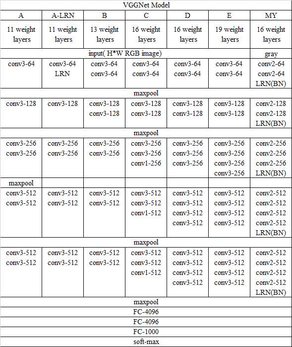

# 表情识别
使用各种模型解决 fer2013 数据集的表情识别问题

[](https://choosealicense.com/licenses/mit/)
[](https://github.com/go88/fer2013-recognition/pulls)
[](https://github.com/go88/fer2013-recognition/releases)

# 目录
```
/drive/machine_learning/fer2013/ 存放模型和数据
/*_model/
         *_eval.py   验证模型
         *_model_train.py    模型和训练
/fer2013_input.py   数据读取
/images/    图片资料
```
## 1. 简单模型

TensorFlow 原生API实现3层卷积3层池化

## 2. VGGNet 模型
我在 D 模型基础上,在每一层卷积后加入 LRN 层或 BN 层使训练效果更好


